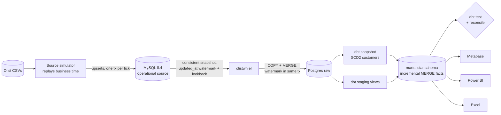
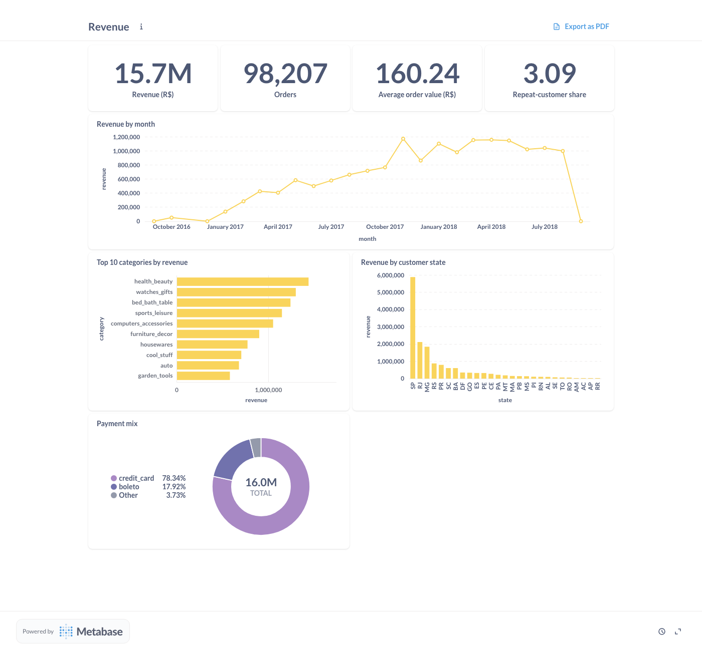
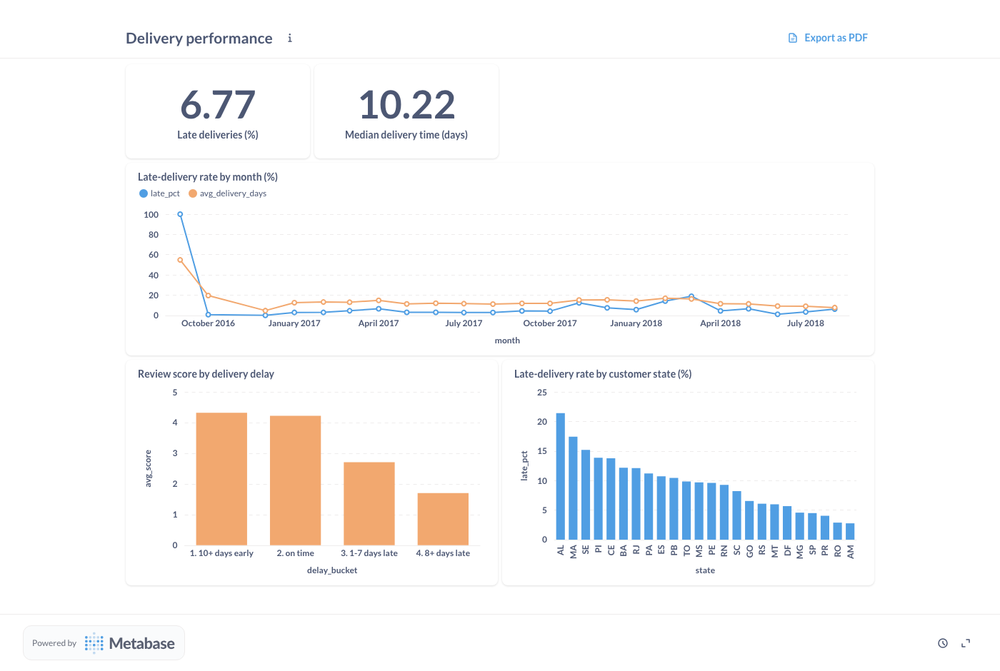
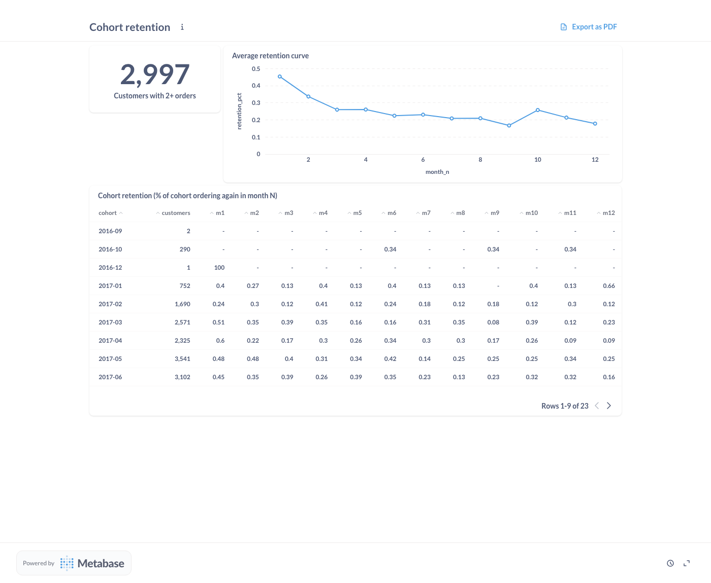

# E-Commerce Analytics Warehouse

[](https://github.com/AnuragBhandary/Ecommerce-Analytics-Warehouse/actions/workflows/ci.yml)


An analytics warehouse for the [Olist Brazilian e-commerce dataset](https://www.kaggle.com/datasets/olistbr/brazilian-ecommerce)
(about **100,000 orders**, 2016–2018), built around the parts of data engineering that only show up
when data **changes**: incremental loads, late-arriving commits, crashes mid-load, and dimensions
that change over time.

The dataset is a static snapshot, so the source is a **simulator** that replays its own timeline
into MySQL. Orders arrive and then move through approval, shipping and delivery; review surveys
get answered; customers who order again from a new address get their address updated.

**Stack:** MySQL 8.4 (source) · Python EL · PostgreSQL 16 (warehouse) · dbt 1.9 · Apache Airflow
2.10 · Metabase · Power BI · Excel · Docker Compose · GitHub Actions

### Measured results ([details](docs/RESULTS.md))

| Full dataset replayed in 27 ticks of 30 business days | |
|---|---|
| Data | **99,441 orders**, 112,650 items, **597,649** source row changes (inserts + updates) |
| Every tick | **85/85 dbt tests** and **32/32 reconciliation checks** passed |
| Incremental vs full rebuild | **hash-identical** across all 10 marts |
| Rerun with no new data | 0 rows applied, identical hashes |
| Load `SIGKILL`ed mid-transaction | watermark and raw unchanged; retry reconciled 32/32 |
| Revenue, source vs marts | R$ 15,843,553.24 on both sides, to the cent |
| SCD2 | 218 of 259 address changes versioned at 30-day ticks (limit documented) |

The checks caught four real bugs while this was being built, including an incremental model
whose statuses silently froze. That one was only visible by comparing against a full rebuild
([RESULTS.md](docs/RESULTS.md#bugs-the-checks-caught-while-building-this)).

## Architecture



Airflow DAG `olist_elt`, every 10 minutes:
**extract_load → dbt_snapshot → dbt_run → dbt_test → reconcile**. A failing test or a
reconciliation mismatch stops the run before anyone reads bad numbers.

| Guarantee | How |
|---|---|
| No change is missed | `updated_at` watermark with a **lookback window** that re-reads recent history for transactions that committed late |
| Reruns are idempotent | MERGE applies only strictly newer versions; a rerun with no new data applies 0 rows and leaves identical hashes |
| A crash leaves nothing half-loaded | Data and watermark commit in **one** PostgreSQL transaction; tested with SIGKILL mid-load |
| Raw is internally consistent | All tables read from one MySQL `WITH CONSISTENT SNAPSHOT` transaction |
| Orders join the customer's address *at purchase time* | dbt snapshot (SCD2) on business time plus a point-in-time join |
| Incremental = correct | Proof run: incremental marts are hash-identical to `dbt run --full-refresh` |
| Warehouse = source | Reconciliation checks every row (missing / stale / phantom) and revenue to the cent |

Reasoning, alternatives and limits are in **[docs/DESIGN.md](docs/DESIGN.md)**.

## Star schema

| Facts (grain) | Dimensions |
|---|---|
| `fct_orders` (order) · `fct_order_items` (item) · `fct_payments` (payment) · `fct_reviews` (survey) | `dim_customer` (SCD2) · `dim_product` · `dim_seller` · `dim_date` |

Plus `mart_seller_monthly` (seller × month, for Excel and Power BI) and `mart_customer_cohorts`
(retention). **85 dbt tests**: keys, foreign keys, accepted values, ranges, and singular business
rules (SCD2 versions tile time, order revenue = sum of items to the cent, cohort month 0 = whole
cohort). Two are deliberate warnings for known Olist data issues.

## Dashboards and reports

- **Metabase** (`localhost:3000`): Revenue, Cohort retention and Delivery performance dashboards,
  created through the API by [`metabase/setup_dashboards.py`](metabase/setup_dashboards.py)
- **Power BI**: 4-page report, 33 DAX measures (YoY/MoM, YTD, running total, cohort retention,
  on-time delivery rate), drill-through by seller, row-level security by seller state:
  [build guide](powerbi/README.md) · [measures.dax](powerbi/measures.dax)
- **Excel**: seller-performance workbook with Power Query, PivotTables, XLOOKUP scorecard and
  conditional formatting, reconciled to the Power BI total: [build guide](excel/README.md)

All three read the `marts` schema through `bi_reader`, a role that can only SELECT from marts.



| Delivery performance | Cohort retention |
|---|---|
|  |  |

The headline finding is in the delivery dashboard: orders delivered 8+ days late average a review
score of about **1.7**, against about **4.3** for on-time orders. (Revenue drops in Sep–Oct 2018
because the Olist data ends there.)

## Quick start

```bash
make install                 # uv sync (Python 3.12, dbt included)
make data                    # Olist CSVs into data/ (~45 MB)
make up                      # MySQL, Postgres, Airflow :8080 (admin/admin), Metabase :3000
make seed                    # replay the source up to 2017-06-01
make pipeline                # EL -> dbt snapshot -> dbt build -> reconcile, by hand
make dashboards              # Metabase dashboards via its API
make live                    # keep the source moving; unpause olist_elt in Airflow to follow it
```

Other commands: `uv run olistwh sim status`, `uv run olistwh sim advance --days 30`,
`make export` (marts to CSV for Power BI or Excel without Docker), `make check`
(ruff, mypy, pytest), `make prove` (the full proof run, ~6 min).

## Tests

`make test` runs 20 tests against real MySQL and PostgreSQL, at 95% coverage. They use a committed
2,000-order sample (`tests/fixtures/olist_sample`), so CI needs no download:

- replaying the source in random tick sizes always ends in the same state as one jump
- incremental loads tick by tick equal one full load; a rerun applies 0 rows
- a late commit is **lost** with `lookback=0` (and reconciliation flags it as stale) and
  **recovered** with the default lookback
- SIGKILL after two tables are merged but before commit leaves raw and the watermark untouched
- reconciliation pinpoints a deleted row, a stale version, and the revenue gap it causes
- the full CLI + `dbt build` path, twice, so the second dbt run is an incremental MERGE

## Project layout

```
src/olistwh/        timeline (business-time model), simulator, extract_load, reconcile, cli
warehouse/          dbt project: staging, snapshots, marts, tests, macros
airflow/dags/       olist_elt DAG
metabase/           dashboards-as-code
powerbi/  excel/    build guides, DAX measures
scripts/prove.py    full-data proof run -> docs/results.json
docs/               DESIGN, RESULTS, INTERVIEW
```

Data: Olist, CC BY-NC-SA 4.0. Code: MIT.
